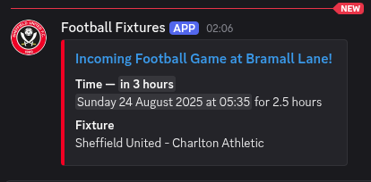

# Football Fixtures Webhook

Check football fixtures list for any fixtures in the near future.
If any are found, send a Discord webhook for each.

Pulls fixtures from <https://fixtur.es/en/team/sheffield-united-fc/home>



## Setup

To start, generate a GitHub webhook, then follow these vague steps:

```crontab
# clone
cd /usr/alifeee/
git clone git@github.com:sheffieldhackspace/football-fixtures-webhook.git
cd /usr/alifeee/football-fixtures-webhook
# add Discord webhook
cp .env.example .env
nano .env
# test
./check-and-send 700
# add cron job
crontab -e
# 0 4 * * * (cd /usr/alifeee/football-fixtures-webhook; ./check-and-send.sh >> cron.log 2>&1)
```
